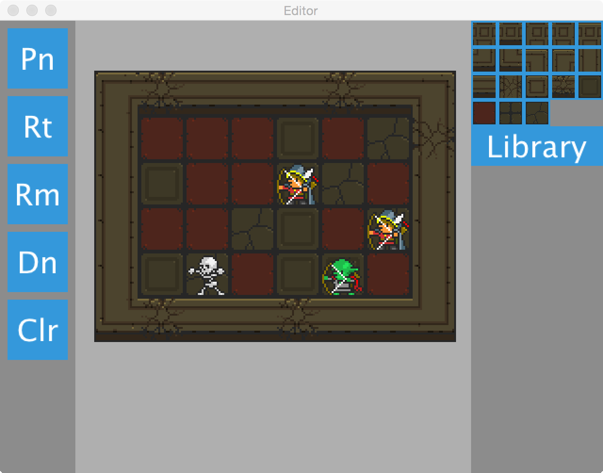

Dungeon Editor
==============

A mixed-initiative editor for a 2D tile based dungeon games.  This isn't really a full map editor, it's a demo that let me try out a simple dungeon generation method.

Installing
----------
To run it you will need to put the [Oryx Design Labs 16-bit Fantasy Sprite Set](http://oryxdesignlab.com/product-sprites/16-bit-fantasy-sprite-set) into the data folder.  They are really cool.
